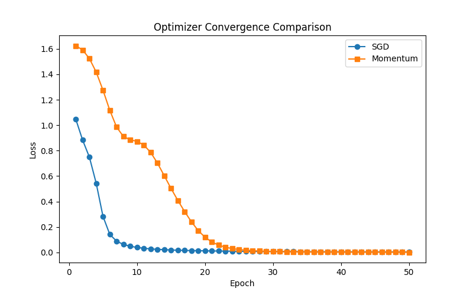
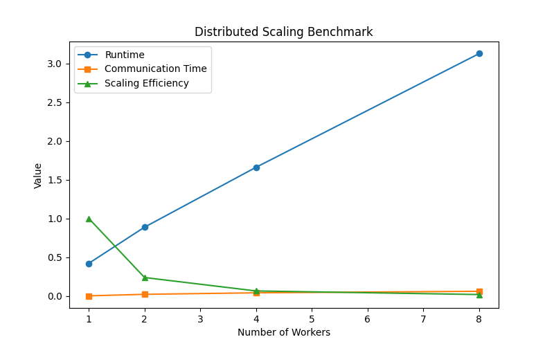
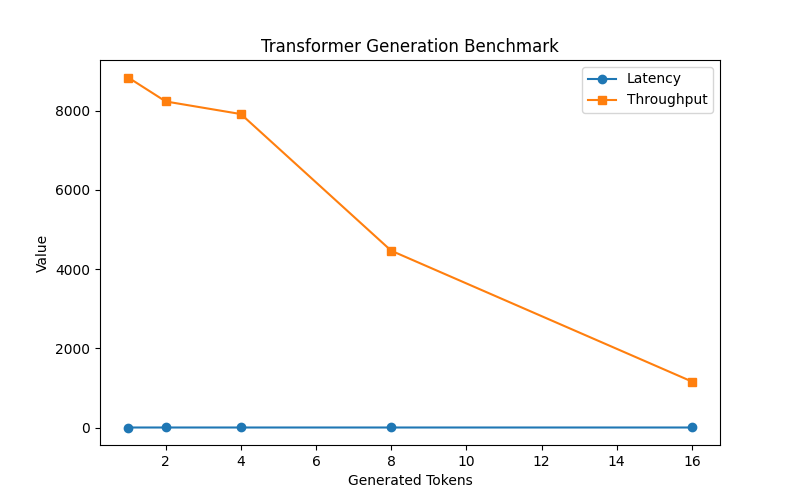
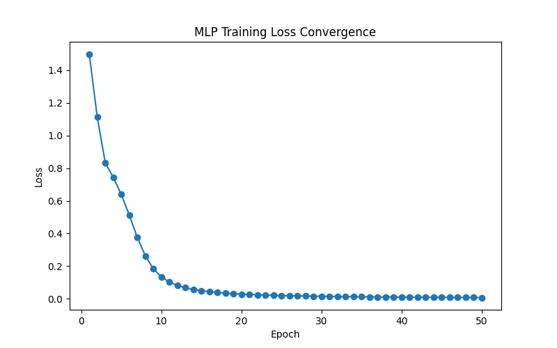

<div align="center">

# Atlas AI
### Distributed AI Infrastructure · Transformer Systems · Performance Engineering

</div>

Atlas AI is an open machine learning systems platform focused on:

- Distributed training infrastructure
- Transformer systems engineering
- Inference optimization
- Performance benchmarking
- Observability and diagnostics
- AI infrastructure research

The project is built from first principles to explore how modern AI systems behave under real engineering constraints such as:

- Memory scaling
- Communication overhead
- Synchronization cost
- Inference latency
- Throughput efficiency
- Transformer cache growth

---

## Core Systems

### Deep Learning Infrastructure

- Reverse-mode autograd engine
- Neural network framework
- MLP training runtime
- Optimizer abstractions (SGD + Momentum)
- Checkpointing system

---

### Transformer Infrastructure

- Token embeddings
- Positional encoding
- Self-attention
- Transformer blocks
- Tiny transformer model
- KV-cache system
- Autoregressive decoding
- Streaming token generation

---

### Distributed Systems

- Multiprocessing distributed runtime
- Gradient synchronization
- Communication profiling
- Distributed scaling simulation
- Runtime scaling benchmarks

---

### Serving & Observability

- FastAPI inference server
- Inference latency monitoring
- Transformer memory diagnostics
- Dashboard metrics
- Historical benchmark persistence
- Regression detection infrastructure

---

### Performance Engineering

- Optimizer benchmarking
- Distributed runtime benchmarking
- Transformer generation benchmarking
- Memory profiling
- CI performance automation

---

## Architecture Overview

```text
                        ┌────────────────────┐
                        │  Transformer Stack │
                        │--------------------│
                        │ Embeddings         │
                        │ Positional Encoding│
                        │ Self-Attention     │
                        │ Transformer Blocks │
                        │ KV Cache           │
                        └─────────┬──────────┘
                                  │
                     ┌────────────▼────────────┐
                     │  Training Infrastructure │
                     │--------------------------│
                     │ Autograd Engine          │
                     │ Optimizers               │
                     │ Checkpointing            │
                     │ Experiment Tracking      │
                     └────────────┬─────────────┘
                                  │
                   ┌──────────────▼──────────────┐
                   │ Distributed Runtime          │
                   │------------------------------│
                   │ Multiprocessing Workers      │
                   │ Gradient Synchronization     │
                   │ Communication Profiling      │
                   │ Scaling Simulation           │
                   └──────────────┬──────────────┘
                                  │
                    ┌─────────────▼─────────────┐
                    │ Serving & Observability   │
                    │---------------------------│
                    │ FastAPI Inference Server  │
                    │ Streaming Generation      │
                    │ Dashboard Metrics         │
                    │ Memory Diagnostics        │
                    │ Regression Detection      │
                    └───────────────────────────┘
```

---

## Benchmark Visualizations

### Optimizer Convergence



---

### Distributed Runtime Scaling



---

### Transformer Generation Benchmark



---

### Training Loss Convergence



---

## Example Capabilities

### Run Distributed Runtime

```bash
atlas run-distributed
```

### Train Transformer Components

```bash
atlas train
```

### Run Benchmarks

```bash
PYTHONPATH=. python scripts/benchmark_optimizers.py
```

```bash
PYTHONPATH=. python scripts/benchmark_transformer_generation.py
```

---

## Example Serving Endpoints

### Inference API

```text
POST /predict
```

### Metrics API

```text
GET /metrics
```

### Dashboard API

```text
GET /dashboard
```

---

## Engineering Focus

Atlas AI focuses on:

- Distributed ML systems
- Transformer inference engineering
- Memory-aware infrastructure
- Performance benchmarking
- Observability systems
- Scalable AI serving
- Optimization diagnostics

---

## Current Research Areas

- KV-cache optimization
- Distributed synchronization overhead
- Transformer memory scaling
- Autoregressive inference latency
- Streaming generation systems
- Performance regression analysis

---

## Future Roadmap

### Distributed Training

- Asynchronous gradient synchronization
- Tensor parallelism
- Pipeline parallelism
- Optimizer state sharding

### Transformer Optimization

- FlashAttention-style kernels
- Quantization
- Efficient attention mechanisms
- Long-context optimization

### Infrastructure Engineering

- Prometheus integration
- Grafana dashboards
- Distributed tracing
- GPU profiling
- Cluster orchestration

---

## CI & Reliability

Atlas AI includes:

- Automated testing
- Benchmark CI workflows
- Regression detection
- Performance validation

GitHub Actions automatically:

- Runs tests
- Executes benchmarks
- Validates infrastructure behavior

---

## Project Philosophy

Atlas AI treats machine learning as a systems engineering problem.

The project focuses on understanding how:

- Communication affects scaling
- Memory constrains transformers
- Inference latency impacts serving
- Optimization changes convergence
- Observability improves reliability

rather than only maximizing model accuracy.

---

## License

MIT

---

<div align="center">

*Omprakash Sahani — ML Systems Engineer (Distributed Training · Optimization · Systems)*

</div>
